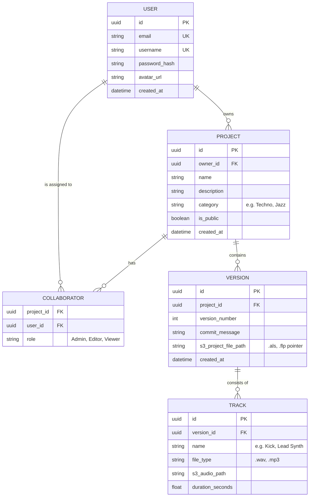

# Part 2: Data & API Modeling

This document defines the data structures and the communication contract (API) for StemHub.

---

## 1. Database Schema (Entity-Relationship Diagram)

StemHub uses a relational model (PostgreSQL) to ensure data integrity and track version history precisely.



---

## 2. API Definition

The backend provides a RESTful API built with **FastAPI**. All communication is via JSON.

### A. Authentication
Secure access using OAuth2 / JWT.

| Endpoint | Method | Description |
| :--- | :--- | :--- |
| `/auth/register` | `POST` | Create a new account. |
| `/auth/login` | `POST` | Get JWT tokens. |

**Example Request (`POST /auth/login`):**
```json
{
  "email": "user@example.com",
  "password": "secure_password"
}
```

---

### B. Project Management
Endpoints for CRUD operations on projects.

| Endpoint | Method | Params | Description |
| :--- | :--- | :--- | :--- |
| `/projects` | `GET` | | List projects for the user. |
| `/projects` | `POST` | | Create a new project. |
| `/projects/{id}` | `GET` | `id` | Get project details. |

**Example Response (`GET /projects/{id}`):**
```json
{
  "id": "550e8400-e29b-41d4-a716-446655440000",
  "name": "Summer Anthem",
  "owner": "ProducerX",
  "is_public": true,
  "created_at": "2026-02-23T10:00:00Z"
}
```

---

### C. Versioning & Files
The core engine of StemHub for DAW project synchronization.

| Endpoint | Method | Params | Description |
| :--- | :--- | :--- | :--- |
| `/projects/{id}/versions` | `GET` | `id` | Get history of versions. |
| `/files/upload-url` | `POST` | `filename`, `type` | **Get pre-signed S3 URL.** |

**Flow for New Version:**
1. Client calls `/files/upload-url` with metadata.
2. Server returns a Signed URL (AWS S3).
3. Client uploads file directly to S3.
4. Client calls `POST /projects/{id}/versions` to confirm the commit.

**Example Request (`POST /files/upload-url`):**
```json
{
  "project_id": "uuid",
  "filename": "project_v2.als",
  "content_type": "application/octet-stream"
}
```

**Example Response:**
```json
{
  "upload_url": "https://s3.eu-west-3.amazonaws.com/stemhub/temp-upload-id?X-Amz-Signature=...",
  "file_id": "file_8872"
}
```

---

## 3. OpenAPI Standard (Swagger)

A standard OpenAPI specification is available at `/docs` when the backend is running. It ensures that the "Contract" between our Python Backend and React Frontend is always synchronized.
