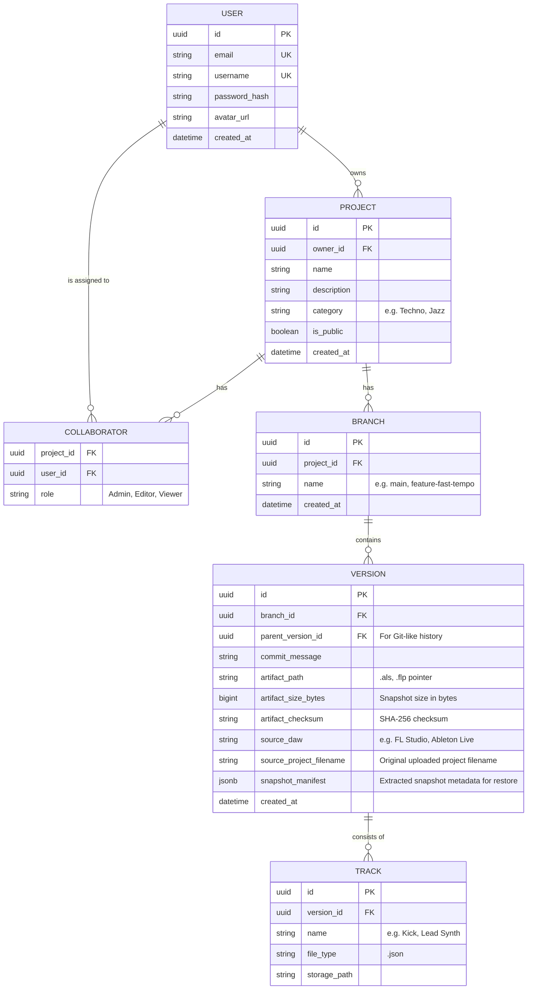

# Part 2: Data & API Modeling

This document defines the data structures and the communication contract (API) for StemHub.

---

## 1. Database Schema (Entity-Relationship Diagram)

StemHub uses a relational model (PostgreSQL) to ensure data integrity and track version history precisely.


```mermaid
erDiagram
    USER ||--o{ PROJECT : owns
    USER ||--o{ COLLABORATOR : "is assigned to"
    PROJECT ||--o{ BRANCH : has
    PROJECT ||--o{ COLLABORATOR : has
    BRANCH ||--o{ VERSION : contains
    VERSION ||--o{ TRACK : "consists of"
    
    USER {
        uuid id PK
        string email UK
        string username UK
        string password_hash
        string avatar_url
        datetime created_at
    }

    PROJECT {
        uuid id PK
        uuid owner_id FK
        string name
        string description
        string category "e.g. Techno, Jazz"
        boolean is_public
        datetime created_at
    }

    COLLABORATOR {
        uuid project_id FK
        uuid user_id FK
        string role "Admin, Editor, Viewer"
    }

    BRANCH {
        uuid id PK
        uuid project_id FK
        string name "e.g. main, feature-fast-tempo"
        datetime created_at
    }

    VERSION {
        uuid id PK
        uuid branch_id FK
        uuid parent_version_id FK "For Git-like history"
        string commit_message
        string artifact_path ".als, .flp pointer"
        bigint artifact_size_bytes "Snapshot size in bytes"
        string artifact_checksum "SHA-256 checksum"
        string source_daw "e.g. FL Studio, Ableton Live"
        string source_project_filename "Original uploaded project filename"
        jsonb snapshot_manifest "Extracted snapshot metadata for restore"
        datetime created_at
    }

    TRACK {
        uuid id PK
        uuid version_id FK
        string name "e.g. Kick, Lead Synth"
        string file_type ".json"
        string storage_path
    }
```

---

## 2. API Definition

The backend provides a RESTful API built with **FastAPI**. All communication is via JSON.

### A. Authentication
Secure access using OAuth2 / JWT.

| Endpoint | Method | Description |
| :--- | :--- | :--- |
| `/auth/register` | `POST` | Create a new account. |
| `/auth/login` | `POST` | Get JWT tokens. |
| `/auth/me` | `GET` | Get the authenticated user profile. |

**Example Request (`POST /auth/login`):**
```json
{
  "email": "user@example.com",
  "password": "secure_password"
}
```

**Example Response (`GET /auth/me`):**
```json
{
  "id": "550e8400-e29b-41d4-a716-446655440000",
  "email": "user@example.com",
  "username": "ProducerX",
  "avatar_url": null,
  "created_at": "2026-03-03T10:00:00Z",
  "is_active": true
}
```

---

### B. Project Management
Endpoints for CRUD operations on projects.

| Endpoint | Method | Params | Description |
| :--- | :--- | :--- | :--- |
| `/projects` | `GET` | | List projects for the user. |
| `/projects` | `POST` | | Create a new project. |
| `/projects/{id}` | `GET` | `id` | Get project details. |

**Example Response (`GET /projects/{id}`):**
```json
{
  "id": "550e8400-e29b-41d4-a716-446655440000",
  "name": "Summer Anthem",
  "owner": "ProducerX",
  "is_public": true,
  "created_at": "2026-02-23T10:00:00Z"
}
```

---

### C. Versioning, Branches & Files
The core engine of StemHub for DAW project synchronization (Git-like workflow).

| Endpoint | Method | Params | Description |
| :--- | :--- | :--- | :--- |
| `/projects/{id}/branches` | `GET` | `id` | List branches (e.g., `main`, `feature`). |
| `/branches/{id}/versions` | `GET` | `id` | Get history of versions for a branch. |
| `/versions/{version_id}/artifact` | `POST` | `artifact` | **Upload version snapshot/artifact.** |
| `/versions/{version_id}/artifact` | `GET` | | **Download version snapshot/artifact.** |

**Flow for New Version (Push):**
1. Client calls `POST /branches/{id}/versions` with metadata to create a version record.
2. Server returns the new `version_id`.
3. Client uploads the file artifact via `POST /versions/{version_id}/artifact`.

**Example Request (`POST /branches/{id}/versions`):**
```json
{
  "commit_message": "Added lead synth",
  "source_daw": "Ableton Live"
}
```

**Example Response:**
```json
{
  "id": "abc-123",
  "branch_id": "def-456",
  "commit_message": "Added lead synth"
}
```

---

## 3. OpenAPI Standard (Swagger)

A standard OpenAPI specification is available at `/docs` when the backend is running. It ensures that the "Contract" between our Python Backend and React Frontend is always synchronized.
