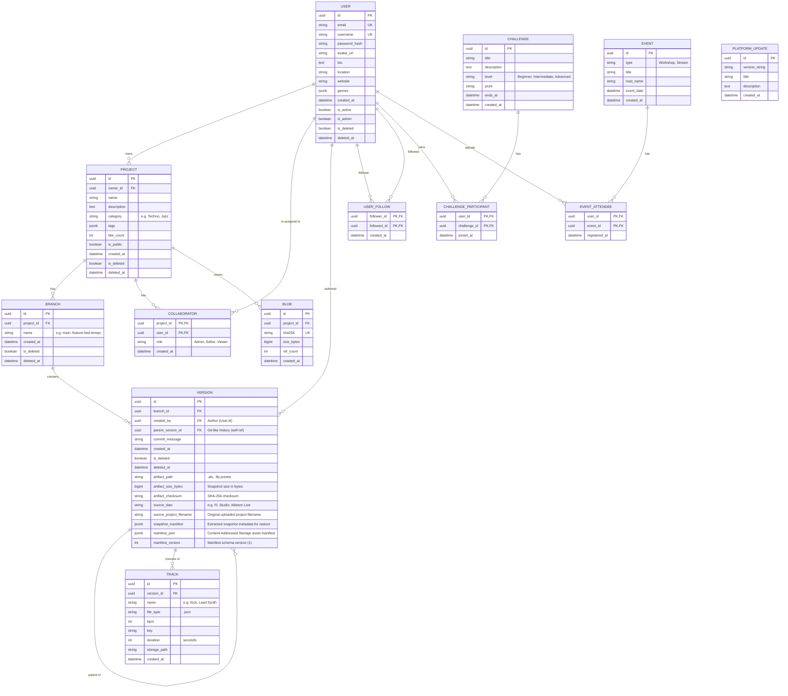

# Part 2: Data & API Modeling

This document defines the data structures and the communication contract (API) for StemHub.

---

## 1. Database Schema (Entity-Relationship Diagram)

StemHub uses a relational model (PostgreSQL) to ensure data integrity and track version history precisely.


```mermaid
erDiagram
    USER ||--o{ PROJECT : owns
    USER ||--o{ COLLABORATOR : "is assigned to"
    USER ||--o{ VERSION : authored
    USER ||--o{ USER_FOLLOW : follower
    USER ||--o{ USER_FOLLOW : followed
    USER ||--o{ CHALLENGE_PARTICIPANT : joins
    USER ||--o{ EVENT_ATTENDEE : attends
    PROJECT ||--o{ BRANCH : has
    PROJECT ||--o{ COLLABORATOR : has
    PROJECT ||--o{ BLOB : stores
    BRANCH ||--o{ VERSION : contains
    VERSION ||--o{ VERSION : "parent of"
    VERSION ||--o{ TRACK : "consists of"
    CHALLENGE ||--o{ CHALLENGE_PARTICIPANT : has
    EVENT ||--o{ EVENT_ATTENDEE : has

    USER {
        uuid id PK
        string email UK
        string username UK
        string password_hash
        string avatar_url
        text bio
        string location
        string website
        jsonb genres
        datetime created_at
        boolean is_active
        boolean is_admin
        boolean is_deleted
        datetime deleted_at
    }

    PROJECT {
        uuid id PK
        uuid owner_id FK
        string name
        text description
        string category "e.g. Techno, Jazz"
        jsonb tags
        int like_count
        boolean is_public
        datetime created_at
        boolean is_deleted
        datetime deleted_at
    }

    BLOB {
        uuid id PK
        uuid project_id FK
        string sha256 UK
        bigint size_bytes
        int ref_count
        datetime created_at
    }

    COLLABORATOR {
        uuid project_id PK,FK
        uuid user_id PK,FK
        string role "Admin, Editor, Viewer"
        datetime created_at
    }

    BRANCH {
        uuid id PK
        uuid project_id FK
        string name "e.g. main, feature-fast-tempo"
        datetime created_at
        boolean is_deleted
        datetime deleted_at
    }

    VERSION {
        uuid id PK
        uuid branch_id FK
        uuid created_by FK "Author (User.id)"
        uuid parent_version_id FK "Git-like history (self-ref)"
        string commit_message
        datetime created_at
        boolean is_deleted
        datetime deleted_at
        string artifact_path ".als, .flp pointer"
        bigint artifact_size_bytes "Snapshot size in bytes"
        string artifact_checksum "SHA-256 checksum"
        string source_daw "e.g. FL Studio, Ableton Live"
        string source_project_filename "Original uploaded project filename"
        jsonb snapshot_manifest "Extracted snapshot metadata for restore"
        jsonb manifest_json "Content-Addressed Storage asset manifest"
        int manifest_version "Manifest schema version (1)"
    }

    TRACK {
        uuid id PK
        uuid version_id FK
        string name "e.g. Kick, Lead Synth"
        string file_type ".json"
        int bpm
        string key
        int duration "seconds"
        string storage_path
        datetime created_at
    }

    USER_FOLLOW {
        uuid follower_id PK,FK
        uuid followed_id PK,FK
        datetime created_at
    }

    PLATFORM_UPDATE {
        uuid id PK
        string version_string
        string title
        text description
        datetime created_at
    }

    CHALLENGE {
        uuid id PK
        string title
        text description
        string level "Beginner, Intermediate, Advanced"
        string prize
        datetime ends_at
        datetime created_at
    }

    CHALLENGE_PARTICIPANT {
        uuid user_id PK,FK
        uuid challenge_id PK,FK
        datetime joined_at
    }

    EVENT {
        uuid id PK
        string type "Workshop, Stream"
        string title
        string host_name
        datetime event_date
        datetime created_at
    }

    EVENT_ATTENDEE {
        uuid user_id PK,FK
        uuid event_id PK,FK
        datetime registered_at
    }
```

---

## 2. API Definition

The backend provides a RESTful API built with **FastAPI**. All communication is via JSON.

### A. Authentication
Secure access using OAuth2 / JWT with **HttpOnly cookies** for session management.

| Endpoint | Method | Description |
| :--- | :--- | :--- |
| `/auth/register` | `POST` | Create a new account. Sets `access_token` cookie. |
| `/auth/login` | `POST` | Get JWT tokens and set `access_token` HttpOnly cookie. |
| `/auth/login/google` | `GET` | Initiate Google OAuth2 login flow. |
| `/auth/logout` | `POST` | Clear the session cookie. |
| `/auth/me` | `GET` | Get the authenticated user profile. |
| `/auth/me` | `PUT` | Update user profile (username, bio, avatar, etc.). |

**Example Request (`POST /auth/login`):**
```json
{
  "email": "user@example.com",
  "password": "secure_password"
}
```

**Example Response (`GET /auth/me`):**
```json
{
  "id": "550e8400-e29b-41d4-a716-446655440000",
  "email": "user@example.com",
  "username": "ProducerX",
  "avatar_url": null,
  "created_at": "2026-03-03T10:00:00Z",
  "is_active": true
}
```

---

### B. Project Management
Endpoints for CRUD operations on projects.

| Endpoint | Method | Params | Description |
| :--- | :--- | :--- | :--- |
| `/projects` | `GET` | | List projects for the user. |
| `/projects` | `POST` | | Create a new project. |
| `/projects/{id}/summary` | `GET` | `id` | Get optimized project summary (branches, recent versions). |
| `/projects/{id}/preview` | `POST` | `id` | **Upload project audio preview.** |
| `/projects/{id}/preview` | `GET` | `id` | **Download project audio preview.** |
| `/projects/{id}/preview` | `DELETE`| `id` | Remove project preview. |

**Example Response (`GET /projects/{id}`):**
```json
{
  "id": "550e8400-e29b-41d4-a716-446655440000",
  "name": "Summer Anthem",
  "owner": "ProducerX",
  "is_public": true,
  "created_at": "2026-02-23T10:00:00Z"
}
```

---

### C. Versioning, Branches & Files
The core engine of StemHub for DAW project synchronization (Git-like workflow).

| Endpoint | Method | Params | Description |
| :--- | :--- | :--- | :--- |
| `/projects/{id}/branches/` | `GET` | `id` | List branches (e.g., `main`, `feature`). |
| `/branches/{id}/versions/` | `GET` | `id` | Get history of versions for a branch. |
| `/branches/{id}/versions/` | `POST` | `id` | Create a new version record. |
| `/branches/{id}/versions/from-manifest` | `POST` | `id` | **Create version from SHA-256 CAS manifest.** |
| `/versions/{id}/artifact` | `POST` | `id` | **Upload legacy version snapshot/artifact.** |
| `/versions/{id}/artifact` | `GET` | `id` | **Download legacy version snapshot/artifact.** |
| `/projects/{id}/blobs/check-missing` | `POST` | `id` | Check which SHA-256 blobs are missing on server. |
| `/projects/{id}/blobs/{sha256}` | `PUT` | `id`, `sha256` | Upload missing SHA-256 blob. |
| `/projects/{id}/blobs/{sha256}` | `GET` | `id`, `sha256` | Download SHA-256 blob (handles presigned URL redirects). |
| `/api/admin/blobs/gc` | `POST` | | Admin operator endpoint to purge unreferenced blobs (`ref_count == 0`). |

**Flow for Content-Addressed Version Push (CAS):**
1. Client hashes project files and calls `POST /projects/{id}/blobs/check-missing` with SHA-256 hashes.
2. Server returns list of missing hashes.
3. Client uploads only missing blobs via `PUT /projects/{id}/blobs/{sha256}`.
4. Client creates version record via `POST /branches/{id}/versions/from-manifest` with `manifest_json`.

**Flow for Legacy Version Push:**
1. Client calls `POST /branches/{id}/versions` with metadata to create a version record.
2. Server returns the new `version_id`.
3. Client uploads the file artifact via `POST /versions/{version_id}/artifact`.

**Example Request (`POST /branches/{id}/versions`):**
```json
{
  "commit_message": "Added lead synth",
  "source_daw": "Ableton Live"
}
```

**Example Response:**
```json
{
  "id": "abc-123",
  "branch_id": "def-456",
  "commit_message": "Added lead synth"
}
```

---

## 3. OpenAPI Standard (Swagger)

A standard OpenAPI specification is available at `/docs` when the backend is running. It ensures that the "Contract" between our Python Backend and React Frontend is always synchronized.
