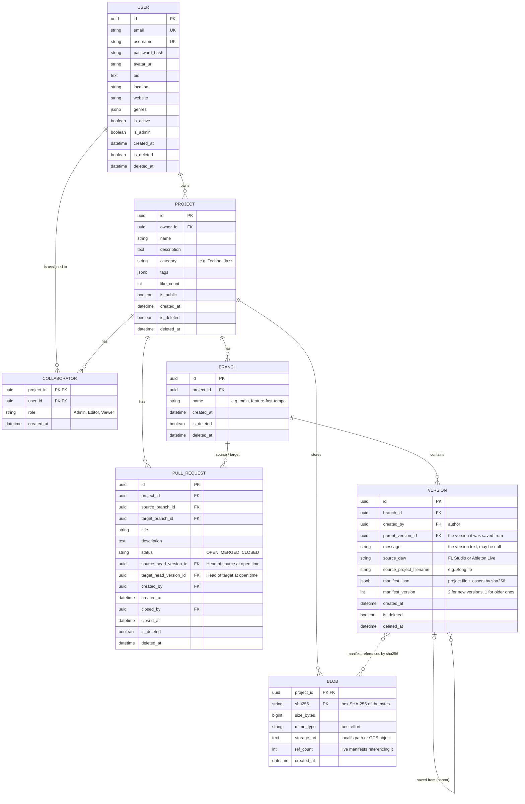

# Part 2: Data & API Modeling

This document describes StemHub's data model and the API the web app and the StemHub plugin use. Terms follow the glossary in [SPECIFICATION.md §19](./SPECIFICATION.md#19--glossary). How files are stored and moved (blobs, manifests, save and restore) is detailed in [content-addressed-storage.md](./content-addressed-storage.md).

---

## 1. Database Schema (Entity-Relationship Diagram)

StemHub uses a relational model (PostgreSQL) to keep version history exact. The ORM models in `backend/src/stemhub/models.py` are the source of truth; schema changes go through Alembic migrations.


```mermaid
erDiagram
    USER ||--o{ PROJECT : owns
    USER ||--o{ COLLABORATOR : "is assigned to"
    PROJECT ||--o{ COLLABORATOR : has
    PROJECT ||--o{ BRANCH : has
    PROJECT ||--o{ BLOB : stores
    PROJECT ||--o{ PULL_REQUEST : has
    BRANCH ||--o{ VERSION : contains
    VERSION |o--o{ VERSION : "saved from (parent)"
    VERSION }o..o{ BLOB : "manifest references by sha256"
    BRANCH ||--o{ PULL_REQUEST : "source / target"

    USER {
        uuid id PK
        string email UK
        string username UK
        string password_hash
        string avatar_url
        text bio
        string location
        string website
        jsonb genres
        boolean is_active
        boolean is_admin
        datetime created_at
        boolean is_deleted
        datetime deleted_at
    }

    PROJECT {
        uuid id PK
        uuid owner_id FK
        string name
        text description
        string category "e.g. Techno, Jazz"
        jsonb tags
        int like_count
        boolean is_public
        datetime created_at
        boolean is_deleted
        datetime deleted_at
    }

    COLLABORATOR {
        uuid project_id PK, FK
        uuid user_id PK, FK
        string role "Admin, Editor, Viewer"
        datetime created_at
    }

    BRANCH {
        uuid id PK
        uuid project_id FK
        string name "e.g. main, feature-fast-tempo"
        datetime created_at
        boolean is_deleted
        datetime deleted_at
    }

    VERSION {
        uuid id PK
        uuid branch_id FK
        uuid created_by FK "author"
        uuid parent_version_id FK "the version it was saved from"
        string message "the version text, may be null"
        string source_daw "FL Studio or Ableton Live"
        string source_project_filename "e.g. Song.flp"
        jsonb manifest_json "project file + assets by sha256"
        int manifest_version "2 for new versions, 1 for older ones"
        datetime created_at
        boolean is_deleted
        datetime deleted_at
    }

    BLOB {
        uuid project_id PK, FK
        string sha256 PK "hex SHA-256 of the bytes"
        bigint size_bytes
        string mime_type "best effort"
        text storage_uri "localfs path or GCS object"
        int ref_count "live manifests referencing it"
        datetime created_at
    }

    PULL_REQUEST {
        uuid id PK
        uuid project_id FK
        uuid source_branch_id FK
        uuid target_branch_id FK
        string title
        text description
        string status "OPEN, MERGED, CLOSED"
        uuid source_head_version_id FK "Head of source at open time"
        uuid target_head_version_id FK "Head of target at open time"
        uuid created_by FK
        datetime created_at
        uuid closed_by FK
        datetime closed_at
        boolean is_deleted
        datetime deleted_at
    }
```

Notes:
- **Soft deletes.** Users, projects, branches, versions and pull requests are never removed; `is_deleted` + `deleted_at` hide them.
- **A version's files** are not rows: `manifest_json` lists the project file and the assets by SHA-256, and each hash is a `BLOB` row of the same project. The dotted line in the diagram is that reference; it is not a foreign key. `ref_count` counts the live manifests that reference a blob (see [content-addressed-storage.md](./content-addressed-storage.md)).
- **`message`** was called `commit_message` before; stored placeholder texts ("Save from plugin") were cleared to `NULL`.
- **`status = 'MERGED'`** is the stored value for an accepted pull request (branch promotion, no content merge).
- The social and community tables (`user_follow`, `platform_update`, `challenge`, `challenge_participant`, `event`, `event_attendee`) back the explore and community pages and are left out of the diagram.

---

## 2. API Definition

The backend is a RESTful API built with **FastAPI**; all bodies are JSON unless a file is uploaded. Routes need a signed-in user, except `/health`, `/ready`, the sign-up and sign-in routes, and the public listings of `/explore` and `/community`. A project someone can't read answers `404`, as if it didn't exist.

Access levels used below: **read** (owner, any collaborator, or anyone for a public project), **write** (owner, or a collaborator with the Admin or Editor role), **owner** (owner only).

### A. Authentication
Sign-in uses OAuth2 / JWT with an **HttpOnly cookie**; the StemHub plugin sends the same token as a bearer header.

| Endpoint | Method | Description |
| :--- | :--- | :--- |
| `/auth/register` | `POST` | Create an account. Sets the `access_token` cookie. |
| `/auth/login` | `POST` | Sign in; returns the token and sets the `access_token` HttpOnly cookie. |
| `/auth/swagger-login` | `POST` | OAuth2 password form, for the `/docs` "Authorize" button. |
| `/auth/login/google` | `GET` | Start the Google OAuth2 flow. |
| `/auth/callback/google` | `GET` | Google OAuth2 callback. |
| `/auth/logout` | `POST` | Clear the cookie. |
| `/auth/me` | `GET` | The signed-in user's profile. |
| `/auth/me` | `PUT` | Update the profile (username, bio, avatar, …). |
| `/auth/me/password` | `PUT` | Change the password. |
| `/auth/me/email` | `PUT` | Change the email address. |

**Example Request (`POST /auth/login`):**
```json
{
  "email": "user@example.com",
  "password": "secure_password"
}
```

**Example Response (`GET /auth/me`):**
```json
{
  "id": "550e8400-e29b-41d4-a716-446655440000",
  "email": "user@example.com",
  "username": "ProducerX",
  "avatar_url": null,
  "created_at": "2026-03-03T10:00:00Z",
  "is_active": true
}
```

---

### B. Projects

| Endpoint | Method | Access | Description |
| :--- | :--- | :--- | :--- |
| `/projects/` | `GET` | | Projects the user owns or collaborates on. |
| `/projects/` | `POST` | | Create a project. Its `main` branch is created with it. |
| `/projects/{id}/summary` | `GET` | read | The project, its branches and up to 10 recent versions (of `?branch_id=`, else of every branch), `latest_version_id` and `has_preview`. |
| `/projects/{id}` | `PUT` | owner | Update name, description, category, visibility. |
| `/projects/{id}` | `DELETE` | owner | Soft-delete the project. |
| `/projects/{id}/preview` | `POST` | write | Upload the project's **preview**: a mixdown (`.wav`, `.mp3`, `.ogg` or `.flac`, multipart field `preview`) for listening on the web. One per project; a new upload replaces it. |
| `/projects/{id}/preview` | `GET` | read | Download the preview, with its original extension. |
| `/projects/{id}/preview` | `DELETE` | write | Remove the preview. |

**Example Response (`GET /projects/{id}/summary`, shortened):**
```json
{
  "project": {
    "id": "550e8400-e29b-41d4-a716-446655440000",
    "name": "Summer Anthem",
    "category": "House",
    "is_public": false,
    "created_at": "2026-02-23T10:00:00Z",
    "owner": { "id": "…", "username": "ProducerX" }
  },
  "branches": [{ "id": "…", "project_id": "…", "name": "main", "created_at": "…" }],
  "recent_versions": [
    {
      "id": "…",
      "message": "Added lead synth",
      "created_at": "2026-02-24T18:12:00Z",
      "branch_name": "main",
      "author": { "id": "…", "username": "ProducerX" },
      "source_daw": "FL Studio",
      "source_project_filename": "Summer Anthem.flp"
    }
  ],
  "latest_version_id": "…",
  "has_preview": true
}
```

---

### C. Branches

| Endpoint | Method | Access | Description |
| :--- | :--- | :--- | :--- |
| `/projects/{id}/branches/` | `POST` | write | Create a branch. |
| `/projects/{id}/branches/` | `GET` | read | List the project's branches (e.g. `main`, `feature-fast-tempo`). |
| `/branches/{id}` | `GET` | read | Get a branch. |
| `/branches/{id}` | `PUT` | owner | Rename a branch. |
| `/branches/{id}` | `DELETE` | owner | Soft-delete a branch. |

---

### D. Versions

| Endpoint | Method | Access | Description |
| :--- | :--- | :--- | :--- |
| `/branches/{id}/versions/` | `GET` | read | The branch's live versions: its history (clients show it newest first). |
| `/branches/{id}/versions/from-manifest` | `POST` | read (see note) | **Save**: create a version from a manifest whose blobs are all uploaded. |
| `/branches/{id}/versions/compare` | `GET` | read | Mixer diff of two FL Studio versions of the branch: `?base_version_id=…&target_version_id=…`. |
| `/branches/{id}/versions/diff-history` | `GET` | read | The branch's history, newest first, each version with its mixer diff against the version it was saved from (else the one before it). |
| `/versions/{id}` | `GET` | read | A version, with its `manifest_json`. |
| `/versions/{id}/assets` | `GET` | read | The version's **assets** (UI: "Audio & MIDI files"), read from its manifest. |
| `/versions/{id}` | `DELETE` | owner | Soft-delete a version; each blob its manifest references loses one reference. |

Note: version creation checks read access on the branch; the blob uploads a save depends on need write access.

**Save flow** (details and failure handling in [content-addressed-storage.md](./content-addressed-storage.md)):
1. The StemHub plugin hashes the project file and its assets and sends the hashes to `POST /projects/{pid}/blobs/check-missing`.
2. It uploads each missing file with `PUT /projects/{pid}/blobs/{sha256}`.
3. It creates the version with `POST /branches/{bid}/versions/from-manifest`.

**Example Request (`POST /branches/{id}/versions/from-manifest`):**
```json
{
  "message": "Added lead synth",
  "parent_version_id": "9b2f…",
  "manifest": {
    "manifest_version": 2,
    "source_daw": "FL Studio",
    "source_project_filename": "Summer Anthem.flp",
    "project_file": { "sha256": "abc…", "size_bytes": 1843200, "path": "Summer Anthem.flp" },
    "assets": [
      { "sha256": "def…", "size_bytes": 4823040, "path": "Samples/kick.wav" }
    ]
  }
}
```

- `message` is optional (up to 500 characters). `commit_message` is still accepted in its place, so older StemHub plugins keep working.
- `parent_version_id` is the version the saved file was based on, when known; it must be a live version of this branch (`400` otherwise).
- The manifest is v2 (v1 is still accepted, see [content-addressed-storage.md](./content-addressed-storage.md)). `source_daw` must be `"FL Studio"` or `"Ableton Live"` (case and extra spaces are ignored; blank means unknown).
- Every referenced blob must already exist in the project, else `409` with `{"detail": {"error": "missing_blobs", "missing": ["def…"]}}`. On success each referenced blob gains one reference, in the same transaction as the version row.

**Example Response (`201`, `VersionResponse`):**
```json
{
  "id": "4c1d…",
  "branch_id": "def-456",
  "created_by": "550e8400-…",
  "message": "Added lead synth",
  "parent_version_id": "9b2f…",
  "source_daw": "FL Studio",
  "source_project_filename": "Summer Anthem.flp",
  "manifest_json": { "manifest_version": 2, "…": "…" },
  "manifest_version": 2,
  "created_at": "2026-02-24T18:12:00Z",
  "is_deleted": false,
  "deleted_at": null
}
```

**Example Response (`GET /versions/{id}/assets`):**
```json
[
  {
    "id": "def…:0",
    "path": "Samples/kick.wav",
    "name": "kick",
    "file_type": "wav",
    "size_bytes": 4823040
  }
]
```

`id` is `{sha256}:{index}` (two assets may hold the same bytes); `name` is the file name without its extension, taken from `path` (v1 manifests keep their stored `name`), and `file_type` comes from `path`. A version without a manifest returns `[]`. The project file itself is not listed.

**Mixer diff (`compare` and `diff-history`).** Only FL Studio versions are compared: the backend reads each version's project file with PyFLP (`fl_mixer.py`) and diffs the mixers. `compare` answers `400` when both ids are the same and `422` when a version isn't FL Studio or its project file can't be read; `diff-history` marks such entries `"unsupported"` with a `status_message` instead, and the first version of the branch `"initial"`.

```json
{
  "summary": { "total_changes": 2, "inserts_changed": 1, "slots_changed": 1, "parameter_changes": 1 },
  "changes": [
    {
      "type": "insert_volume_changed",
      "insert_index": 3,
      "insert_name": "Bass",
      "slot_index": null,
      "before": 12800,
      "after": 10240,
      "message": "…"
    },
    {
      "type": "slot_plugin_changed",
      "insert_index": 3,
      "insert_name": "Bass",
      "slot_index": 0,
      "before": "Fruity Limiter",
      "after": "Fruity Compressor",
      "message": "…"
    }
  ]
}
```

- `insert_index` uses FL Studio's numbering: the Master insert is `0`. It is `null` for a project-level change.
- `slot_index` is the effect slot's 0-based index; messages show it as FL Studio does (index + 1).
- Change types: `insert_added`, `insert_removed`, `insert_renamed`, `insert_enabled_changed`, `insert_volume_changed`, `insert_pan_changed`, `slot_added`, `slot_removed`, `slot_plugin_changed`, `slot_enabled_changed`, `slot_dry_wet_changed`, and `project_file_changed` (the project file changed but a mixer couldn't be read; `before`/`after` are `{sha256, size_bytes}`).
- Values are FL Studio's raw ones (volume, pan, dry/wet); normalizing units is part of the project model (#170).

---

### E. Blobs (content-addressed storage)

| Endpoint | Method | Access | Description |
| :--- | :--- | :--- | :--- |
| `/projects/{pid}/blobs/check-missing` | `POST` | write | `{"sha256s": [...]}` (at most 1000) → `{"missing": [...]}`: the hashes the project doesn't store yet. |
| `/projects/{pid}/blobs/{sha256}` | `PUT` | write | Upload one file (multipart field `file`). The server hashes the bytes and refuses a mismatch (`400`). Idempotent. |
| `/projects/{pid}/blobs/{sha256}` | `GET` | read | Download one file: the bytes (header `X-Blob-SHA256`), or a `307` to a short-lived signed URL on GCS. |
| `/api/admin/blobs/gc` | `POST` | admin | One pass of the sweep that deletes unreferenced blobs past the grace window. |

---

### F. Pull requests

| Endpoint | Method | Params | Description |
| :--- | :--- | :--- | :--- |
| `/projects/{id}/pull-requests` | `GET` | `id` | List pull requests of a project. |
| `/projects/{id}/pull-requests` | `POST` | `id` | Open a pull request (source → target branch, same project). `409` if an `OPEN` one already exists for the same pair. |
| `/pull-requests/{id}` | `GET` | `id` | Get a pull request. |
| `/pull-requests/{id}/close` | `POST` | `id` | Close without accepting (`OPEN` → `CLOSED`; `409` if not open). `CLOSED` is terminal — users open a new PR instead of reopening. Accepting is a separate, future endpoint. |

**Pull requests — state machine and invariants:**

```
OPEN ──/close───▶ CLOSED
  │
  └───accept (#253)──▶ MERGED
```

- Accepting a pull request is branch promotion, with no content merge ([SPECIFICATION.md §8](./SPECIFICATION.md#8--open-technical-decisions)); the stored status is `MERGED`.
- Both `CLOSED` and `MERGED` are terminal (SPECIFICATION.md §19). A closed PR is not reopened — users open a new PR. Any other transition answers `409`.
- At most one `OPEN` pull request per ordered `(source_branch_id, target_branch_id)` pair, enforced by the partial unique index `uq_pull_request_open_pair` (`WHERE status = 'OPEN' AND is_deleted = false`). Closed, accepted or soft-deleted PRs never block a new one; the reverse direction is a different pair.
- `source_head_version_id` / `target_head_version_id` record the head (latest live version) of each branch when the PR is opened (`NULL` if the branch had none). `Branch` has no head pointer, so this is the only record of what was proposed. Accepting (#253) compares `target_head_version_id` with the live head of the target to refuse a stale promotion.
- `created_by` / `closed_by` record who opened and who closed the PR (nullable: a user may be soft-deleted, and `closed_by` is unset until closure).

---

### G. Collaborators, stats, discovery

| Endpoint | Method | Access | Description |
| :--- | :--- | :--- | :--- |
| `/projects/{id}/collaborators/` | `POST` | owner | Add a collaborator by `username`, with a `role` (Admin, Editor, Viewer). |
| `/projects/{id}/collaborators/` | `GET` | read | List collaborators. |
| `/projects/{id}/collaborators/{user_id}` | `DELETE` | owner | Remove a collaborator. |
| `/projects/{id}/stats/activity` | `GET` | read | Versions saved per day over 26 weeks: `daily_activity`, `total_versions`, `total_contributors`. |
| `/projects/{id}/stats/top-contributors` | `GET` | read | `contributors[]` with their number of `versions`. |
| `/explore/projects` | `GET` | | Public projects (`sort_by`, `tags`, `limit`, `offset`); each has `tempo_bpm` (number or `null`) and `key`. |
| `/explore/feed`, `/explore/producers`, `/explore/changelog` | `GET` | | Activity feed (signed in), producers, platform updates. |
| `/community/challenges`, `/community/events` | `GET` | | Challenges and events; signed-in users join with `POST /community/challenges/{id}/join` and `POST /community/events/{id}/register`. |
| `/api/admin/*` | | admin | Users, stats, admin/active toggles. |
| `/health`, `/ready` | `GET` | | Liveness and readiness probes. |

---

## 3. OpenAPI Standard (Swagger)

A standard OpenAPI specification is available at `/docs` when the backend is running. It keeps the contract between the Python backend, the web app and the StemHub plugin consistent; when this document and `/docs` disagree, `/docs` (generated from the code) wins.
