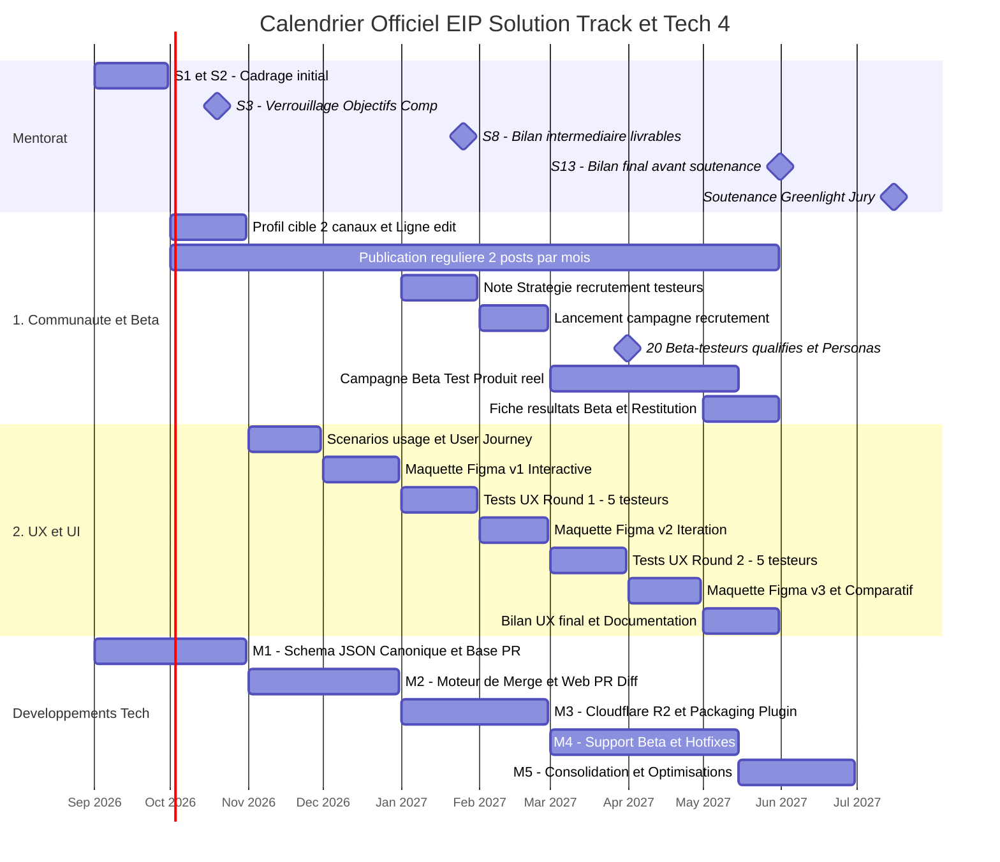

# StemHub — Roadmap & Calendrier Officiel EIP (2026 - 2027)

> **Projet :** StemHub (Git-like Version Control for Music Producers)  
> **Track :** EIP Solution Track — Tech 4 (2026 / 2027)  
> **Soutenance finale :** Jury Greenlight (Juillet 2027)

---

## 1. Diagramme Chronologique Visuel (Gantt)

---

## 2. Tableau des Échéances et Livrables Epitech

| Échéance | Domaine / Objectif | Livrable Exigé par Epitech | Critères & Preuves de Validation |
|---|---|---|---|
| **Septembre 2026** | Mentorat (S1 & S2) | Cadrage initial | Découverte du projet et premières pistes d'objectifs avec le mentor. |
| **Fin Octobre 2026** | 1. Communauté & Beta | Profil cible | Document avec critères vérifiables et lieux de sourcing précis de la cible. |
| **Fin Octobre 2026** | 1. Communauté & Beta | Canaux & Identité | Au moins 2 canaux publics ouverts (Discord, TikTok, etc.) avec charte et rôles définis. |
| **Fin Octobre 2026** | 1. Communauté & Beta | Ligne éditoriale | Ligne éditoriale écrite et planning de publication sur au moins 3 mois. |
| **19 Octobre 2026** | ⚠️ **Mentorat (Séance 3)** | **Verrouillage Objectifs** | **Validation définitive des 2 objectifs complémentaires (aucun changement possible ensuite).** |
| **Octobre à Mai** | 1. Communauté & Beta | Publication régulière | **Au moins 2 posts par mois par canal** (aucun mois vide toléré, captures archivées). |
| **Fin Novembre 2026**| 2. UX / UI | Démarche de design | Scénarios d'usage réalistes, parcours utilisateur complet et priorisation du parcours clé. |
| **Fin Décembre 2026** | 2. UX / UI | **Maquette Figma v1** | Wireframes de structure + **prototype Figma haute-fidélité et interactif** du parcours principal. |
| **Fin Décembre 2026** | Objectifs Complémentaires | Mapping & Qualification | Cartographie qualifiée de 10 à 15 acteurs (Partenaires / Relais / Experts). |
| **Fin Janvier 2027** | 1. Communauté & Beta | Stratégie Recrutement | Note écrite de la stratégie de recrutement des futurs beta-testeurs. |
| **Fin Janvier 2027** | 2. UX / UI | **Tests UX Round 1** | Protocole écrit + **tests sur maquette avec au moins 5 personnes cibles** (observation + verbatims). |
| **Fin Février 2027** | 1. Communauté & Beta | Lancement Campagne | Lancement effectif de la campagne de recrutement des beta-testeurs. |
| **Fin Février 2027** | 2. UX / UI | **Maquette Figma v2** | Maquette v2 modifiée suite aux retours du Test 1 + tableau comparatif des changements. |
| **Fin Mars 2027** | 1. Communauté & Beta | **20 Beta-Testeurs** | **Liste qualifiée de 20 beta-testeurs externes onboardés et actifs.** |
| **Fin Mars 2027** | 1. Communauté & Beta | Personas sourcés | Au moins 2 personas complets basés sur de vrais échanges documentés avec la communauté. |
| **Fin Mars 2027** | 2. UX / UI | **Tests UX Round 2** | Passation du deuxième round de tests UX sur la maquette v2 (5 personnes cibles). |
| **Mars à Mai 2027** | 1. Communauté & Beta | **Déroulement Beta Test** | **Utilisation en conditions réelles du produit développé** (parcours de test, hypothèses, suivi). |
| **Fin Avril 2027** | 2. UX / UI | **Maquette Figma v3** | Maquette v3 finale + comparaison complète des versions v1 / v2 / v3. |
| **Fin Mai 2027** | 1. Communauté & Beta | **Fiche de Résultats Beta** | Bilan complet : panel, hypothèses validées/invalidées, retours consolidés, bugs classés. |
| **Fin Mai 2027** | 1. Communauté & Beta | Restitution Communauté | Tableau de bord de la communauté + preuve publique des retours pris en compte. |
| **Fin Mai 2027** | 2. UX / UI | Bilan UX & Documentation | Synthèse UX, documentation des composants UI et captures montrant l'intégration dans le code. |
| **Fin Mai 2027** | Mentorat (Séance 13) | Bilan des livrables | Consolidation de tous les livrables de l'année et stratégie de présentation. |
| **Juillet 2027** | 🏆 **JURY GREENLIGHT** | **Soutenance Finale** | **Passage devant le jury Epitech avec démo live du produit et dossier de preuves complet.** |
