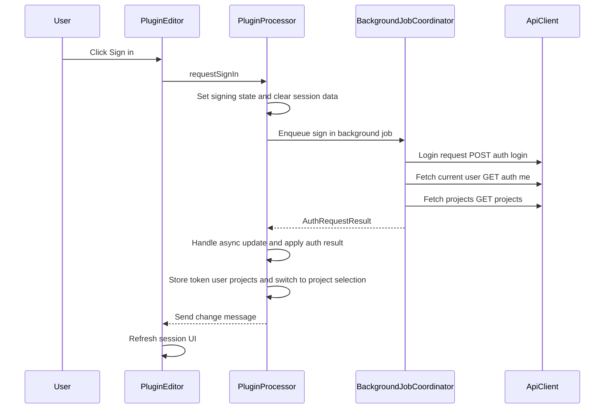
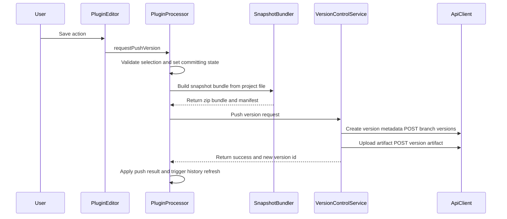
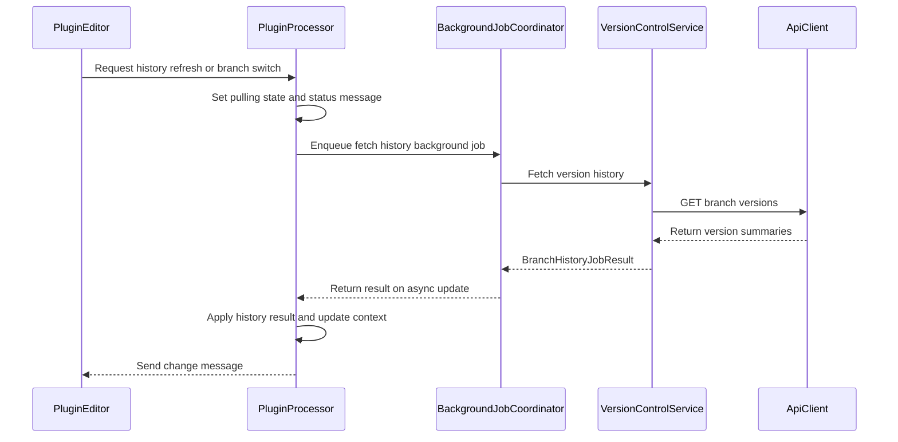

# Plugin Full Data Flow (Connect -> Push/Pull Versions)

This document describes the end-to-end runtime flow in the JUCE plugin, from user connection (sign-in) to version push and pull/refresh.

## 1) Main Components And Responsibilities

- `StemhubAudioProcessorEditor` (`plugin/stemhub/Source/src/ui/PluginEditor.cpp`)
  - Owns UI views and user actions.
  - Translates clicks/shortcuts into processor requests (`requestSignIn`, `requestOpenProject`, `requestPushVersion`, etc.).
- `StemhubAudioProcessor` (`plugin/stemhub/Source/src/application/PluginProcessor.cpp`)
  - Session state owner and orchestration layer.
  - Enqueues background jobs, applies results on JUCE message thread, broadcasts UI updates.
- `BackgroundJobCoordinator` (`plugin/stemhub/Source/include/application/BackgroundJobCoordinator.hpp`)
  - Runs worker tasks (`juce::ThreadPool`), stores typed results, drops stale session generations.
- `ApiClient` / `IProjectApi` (`plugin/stemhub/Source/src/network/ApiClient.cpp`)
  - Raw HTTP transport + JSON parsing.
  - Auth, user, projects, branches, file upload/download.
- `VersionControlService` (`plugin/stemhub/Source/src/network/VersionControlService.cpp`)
  - Version-domain operations: create version, upload artifact, fetch history, restore/download.
- `SnapshotBundler` (`plugin/stemhub/Source/src/application/SnapshotBundler.cpp`)
  - Builds local snapshot artifact + manifest before push.

## 2) Data Objects Moving Through The Flow

- Auth/session: `access_tkn`, `SessionState`, `User`
- Project selection: `projects`, `selectedProject`, `branches`, `selectedBranchId`
- Versioning: `versionHistory`, `selectedVersionId`, `ProjectVersionContext`
- Filesystem: `pendingProjectFile`, `selectedProjectFile`, `pendingProjectFolder`, `selectedProjectFolder`
- Background payloads: `AuthRequestResult`, `ProjectActivationJobResult`, `BranchHistoryJobResult`, `PushVersionJobResult`, `RestoreVersionJobResult`

## 3) End-To-End Lifecycle

1. Plugin editor is created.
2. User signs in from Login view.
3. Processor fetches user + projects; UI moves to Project Selection.
4. User opens an existing project or creates one from a local DAW file.
5. Processor fetches branches and initial version history; UI moves to Dashboard.
6. User pushes a version:
   - local file is bundled,
   - version metadata is created server-side,
   - artifact is uploaded,
   - history refresh is triggered automatically.
7. User pulls latest history manually (refresh) or by branch switch:
   - plugin calls branch version-history endpoint,
   - updates selected version and dashboard data.

## 4) Runtime Pattern Used By All Requests

All major actions follow the same async pattern:

1. UI calls `StemhubAudioProcessor::request*`.
2. Processor sets operation/auth state + status message.
3. Processor calls `enqueueBackgroundTask(...)`.
4. Worker thread executes `perform*Request(...)`.
5. Worker pushes typed result to `BackgroundJobCoordinator`.
6. Completion triggers `triggerAsyncUpdate()`.
7. `handleAsyncUpdate()` runs on message thread, flushes results.
8. `applyBackgroundResult(...)` dispatches to `apply*Result(...)`.
9. Processor state is updated and `sendChangeMessage()` notifies editor.
10. Editor `refreshSessionUi()` re-renders the active view.

## 5) Connect / Sign-In Flow

### API calls

- `POST /auth/login`
- `GET /auth/me`
- `GET /projects/`

### Sequence

## 6) Project Activation Flow (Open Existing Or Create)

### Open existing project

- Input: selected `projectId` + optional local project file.
- API calls:
  - `GET /projects/{projectId}/branches/`
  - `GET /branches/{branchId}/versions/`
- Output:
  - `selectedProject`, `branches`, `selectedBranchId/name`, `versionHistory`, `selectedVersionId`
  - `UIState::dashboard`

### Create project

- Input: local DAW file (`.flp` / `.als`)
- API calls:
  - `POST /projects/`
  - `GET /projects/`
  - `GET /projects/{newProjectId}/branches/`
  - `GET /branches/{branchId}/versions/`
- Output: same dashboard activation state as open flow.

## 7) Push Version Flow

### Preconditions enforced by processor

- Selected project exists.
- Selected branch exists.
- Effective project file exists on disk.

### Data path

1. UI triggers `requestPushVersion(commitMessage, dawName)`.
2. Processor builds `PushVersionRequest` and snapshot bundle:
   - `SnapshotBundler::bundleProject(...)` produces zip + manifest.
3. Processor calls `VersionControlService::pushVersion(...)`.
4. Service calls backend:
   - `POST /branches/{branchId}/versions/` (metadata)
   - `POST /versions/{versionId}/artifact` (binary upload)
5. On success, processor sets last version id and auto-calls `requestRefreshVersionHistory()`.

### Sequence

## 8) Pull / Refresh Version History Flow

This is triggered by:

- user presses refresh in dashboard,
- user selects another branch,
- successful push (automatic follow-up refresh).

### API call

- `GET /branches/{branchId}/versions/`

### Sequence

## 9) Error Propagation Model

- HTTP/network/parsing errors are converted to `ApiError` in `ApiClient`.
- `perform*Request` converts errors into typed job result `errorMessage`.
- `apply*Result` moves processor to `OperationState::error` (or `AuthState::authError`) and updates status messages.
- Editor reads those messages through getters and displays them in active view.

## 10) Independence Boundaries In The Plugin

- UI layer does not call backend directly; it only talks to processor.
- Processor does not perform HTTP directly; it uses `IProjectApi` + `VersionControlService`.
- Network layer (`ApiClient`) is transport-focused and replaceable via `IProjectApi` injection.
- Versioning logic (`VersionControlService`) is isolated from view logic and from JUCE widgets.
- Background execution is centralized (`BackgroundJobCoordinator`) and shared by all request types.
