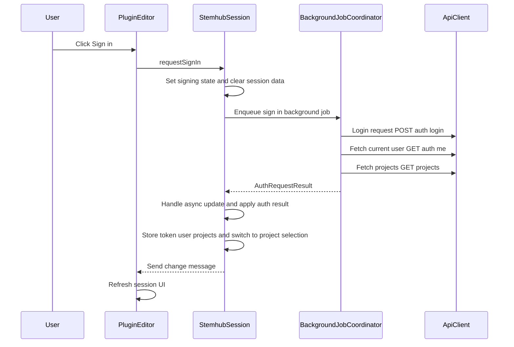
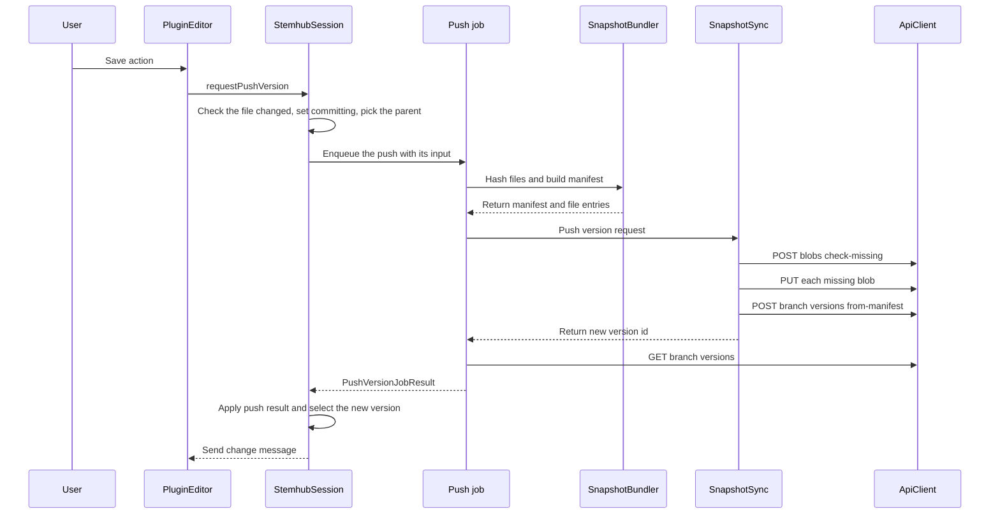
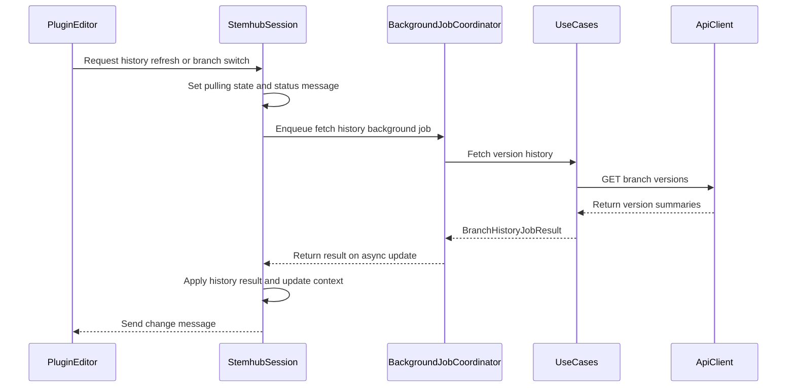

# Plugin Full Data Flow (Connect -> Push/Pull Versions)

This document describes the end-to-end runtime flow in the JUCE plugin, from user connection (sign-in) to version push and pull/refresh.

## 1) Main Components And Responsibilities

- `StemhubAudioProcessor` (`plugin/stemhub/Source/src/application/PluginProcessor.cpp`)
  - What the host sees: audio passes through untouched. Owns the session and creates the editor.
- `StemhubAudioProcessorEditor` (`plugin/stemhub/Source/src/ui/PluginEditor.cpp`)
  - Owns the views. Shows the session's state and turns clicks and shortcuts into its intents
    (`requestSignIn`, `requestOpenProject`, `requestPushVersion`, etc.).
- `StemhubSession` (`plugin/stemhub/Source/src/application/StemhubSession.cpp`)
  - The single owner of `SessionState`, used only on the message thread.
  - Starts one background job at a time, applies its result, and tells listeners through its
    `ChangeBroadcaster`.
- `BackgroundJobCoordinator` (`plugin/stemhub/Source/include/application/BackgroundJobCoordinator.hpp`)
  - Runs jobs on a `juce::ThreadPool` and hands their results to the message thread. Its
    owner's shutdown waits for the running jobs, so none outlives what it uses.
- `IProjectApi` / `ApiClient` (`plugin/stemhub/Source/src/network/ApiClient.cpp`)
  - One typed call per endpoint: auth, user, projects, branches, versions, version manifest,
    blob check/upload/download, version creation from a manifest. The HTTP plumbing is private;
    JSON parsing lives in `ApiJson.cpp`. Every failure is an `ApiError` with a kind (network,
    unauthorized, not found, server, ...).
- `SnapshotSync` (`plugin/stemhub/Source/src/application/SnapshotSync.cpp`)
  - Stateless content-addressed push (upload what the server lacks, then create the version)
    and restore (download into a new folder, verify every SHA-256).
- `UseCases` (`plugin/stemhub/Source/src/application/UseCases.cpp`)
  - The background work of each action, as functions from an input built on the message
    thread to a result the session applies.
- `SnapshotBundler` (`plugin/stemhub/Source/src/application/SnapshotBundler.cpp`)
  - Hashes the project file and its audio files and builds the version manifest; validates
    manifests before a restore (see `docs/content-addressed-storage.md`).

## 2) Data Objects Moving Through The Flow

- `SessionState` holds all of it:
- Auth/session: `authState`, `uiState`, `operationState`, `accessToken`, `currentUser`
- Messages: one `Status` (severity + text) per screen: `authStatus`, `projectsStatus`, `sessionStatus`
- Project selection: `projects`, `selectedProject`, `branches`, `selectedBranchId`
- Versioning: `versionHistory`, `selectedVersionId`, `openedVersionId` (the version in the DAW)
- Filesystem: `pendingProjectFile`, `selectedProjectFile`, working-copy baseline (file, version id, size and modification time recorded by the last save or restore)
- Background payloads: `AuthRequestResult`, `ProjectActivationJobResult`, `BranchHistoryJobResult`, `PushVersionJobResult`, `RestoreVersionJobResult`

## 3) End-To-End Lifecycle

1. Plugin editor is created.
2. User signs in from Login view.
3. The session fetches user + projects; UI moves to Project Selection.
4. User opens an existing project or creates one from a local DAW file.
5. The session fetches branches and initial version history; UI moves to Dashboard. When the
   project is opened from the grid and this instance has no local copy (or an unchanged copy of
   an older version), the latest version is restored into a new folder and opened in the DAW.
   Unsaved local changes are never replaced.
6. User pushes a version:
   - files are hashed and only the ones the server lacks are uploaded,
   - the version is created from the manifest,
   - the history is fetched in the same job and the new version is selected.
7. User pulls latest history manually (refresh) or by branch switch:
   - plugin calls branch version-history endpoint,
   - updates selected version and dashboard data.

## 4) Runtime Pattern Used By All Requests

All major actions follow the same async pattern:

1. UI calls a `StemhubSession::request*` intent. While another job runs it is ignored (sign-out
   excepted), and the views disable the controls that would send it.
2. The session sets the operation state and a progress `Status`, and starts a new request epoch.
3. It enqueues the use case with an input built on the message thread: token, ids, files.
4. A worker runs the use case against `IProjectApi` and returns a typed result tagged with the
   epoch; `BackgroundJobCoordinator` queues it and calls `triggerAsyncUpdate()`.
5. `handleAsyncUpdate()` runs on the message thread and takes the queued results.
6. A result is applied only if its epoch is still the latest. Signing out starts a new epoch, so
   whatever was running before is dropped when it finishes.
7. The session updates `SessionState` and calls `sendChangeMessage()`.
8. The editor's `refreshSessionUi()` re-renders the active view.

## 5) Connect / Sign-In Flow

### API calls

- `POST /auth/login`
- `GET /auth/me`
- `GET /projects/`

### Sequence

```mermaid
sequenceDiagram
    participant U as User
    participant E as PluginEditor
    participant P as StemhubSession
    participant J as BackgroundJobCoordinator
    participant A as ApiClient

    U->>E: Click Sign in
    E->>P: requestSignIn
    P->>P: Set signing state and clear session data
    P->>J: Enqueue sign in background job
    J->>A: Login request POST auth login
    J->>A: Fetch current user GET auth me
    J->>A: Fetch projects GET projects
    J-->>P: AuthRequestResult
    P->>P: Handle async update and apply auth result
    P->>P: Store token user projects and switch to project selection
    P-->>E: Send change message
    E->>E: Refresh session UI
```

## 6) Project Activation Flow (Open Existing Or Create)

### Open existing project

- Input: selected `projectId` + optional local project file.
- API calls:
  - `GET /projects/{projectId}/branches/`
  - `GET /branches/{branchId}/versions/`
- Output:
  - `selectedProject`, `branches`, `selectedBranchId/name`, `versionHistory`, `selectedVersionId`
  - `UIState::dashboard`

### Create project

- Input: local DAW file (`.flp` / `.als`)
- API calls:
  - `POST /projects/`
  - `GET /projects/`
  - `GET /projects/{newProjectId}/branches/`
  - `GET /branches/{branchId}/versions/`
- Output: same dashboard activation state as open flow.

## 7) Push Version Flow

### Preconditions enforced by the session

- No other save, restore or project load is running.
- Selected project exists.
- Selected branch exists.
- Effective project file exists on disk and changed since the last save or restore.

### Data path

1. UI triggers `requestPushVersion(commitMessage, dawName)`.
2. The session picks the parent version (the working copy's version, else the branch head) and
   enqueues the job with everything it needs.
3. `SnapshotBundler::buildManifest(...)` hashes the project file and the audio files in its
   folder; paths are stored relative to that folder.
4. `stemhub::snapshots::pushSnapshot(...)` calls the backend:
   - `POST /projects/{projectId}/blobs/check-missing`
   - `PUT /projects/{projectId}/blobs/{sha256}` for each missing file
   - `POST /branches/{branchId}/versions/from-manifest`
5. The job fetches `GET /branches/{branchId}/versions/`; the session selects the new version
   and makes it the parent of the next save.

### Sequence

```mermaid
sequenceDiagram
    participant U as User
    participant E as PluginEditor
    participant P as StemhubSession
    participant W as Push job
    participant S as SnapshotBundler
    participant V as SnapshotSync
    participant A as ApiClient

    U->>E: Save action
    E->>P: requestPushVersion
    P->>P: Check the file changed, set committing, pick the parent
    P->>W: Enqueue the push with its input
    W->>S: Hash files and build manifest
    S-->>W: Return manifest and file entries
    W->>V: Push version request
    V->>A: POST blobs check-missing
    V->>A: PUT each missing blob
    V->>A: POST branch versions from-manifest
    V-->>W: Return new version id
    W->>A: GET branch versions
    W-->>P: PushVersionJobResult
    P->>P: Apply push result and select the new version
    P-->>E: Send change message
```

## 8) Pull / Refresh Version History Flow

This is triggered by:

- user presses refresh in dashboard,
- user selects another branch,
- a successful push (fetched inside the push job).

### API call

- `GET /branches/{branchId}/versions/`

### Sequence

```mermaid
sequenceDiagram
    participant E as PluginEditor
    participant P as StemhubSession
    participant J as BackgroundJobCoordinator
    participant V as UseCases
    participant A as ApiClient

    E->>P: Request history refresh or branch switch
    P->>P: Set pulling state and status message
    P->>J: Enqueue fetch history background job
    J->>V: Fetch version history
    V->>A: GET branch versions
    A-->>V: Return version summaries
    V-->>J: BranchHistoryJobResult
    J-->>P: Return result on async update
    P->>P: Apply history result and update context
    P-->>E: Send change message
```

## 9) Error Propagation Model

- HTTP/network/parsing errors are converted to `ApiError` in `ApiClient`; a 401 anywhere ends the
  session and returns to the login screen. Offline at startup, the saved session is kept.
- Use cases put the error in their result's `errorMessage` (and flag a 401 as `sessionExpired`).
- The session turns it into a `Status` with a severity (info, progress, success, warning, error)
  on the screen where the action started: `authStatus`, `projectsStatus` or `sessionStatus`.
- The editor maps each severity to the theme's status style; it never guesses from the text.

## 10) Independence Boundaries In The Plugin

- UI layer does not call backend directly; it only talks to the session.
- The session does not perform HTTP directly; its jobs call the use cases, which use `IProjectApi`.
- The session and everything under it build without JUCE's GUI and audio modules: the tests
  link only `juce_events` and `juce_cryptography`.
- Network layer (`ApiClient`) is replaceable via `IProjectApi` injection (the tests use a fake).
- Versioning logic (`SnapshotSync`, `SnapshotBundler`) is isolated from view logic and from JUCE widgets.
- Background execution is centralized (`BackgroundJobCoordinator`) and shared by all request types.
