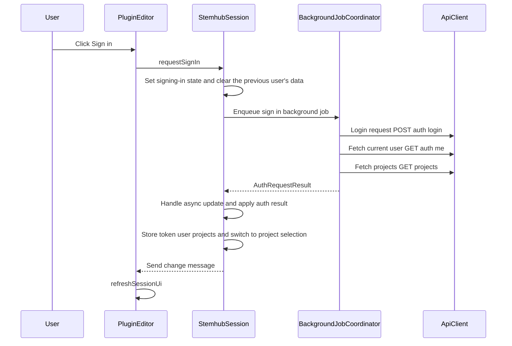
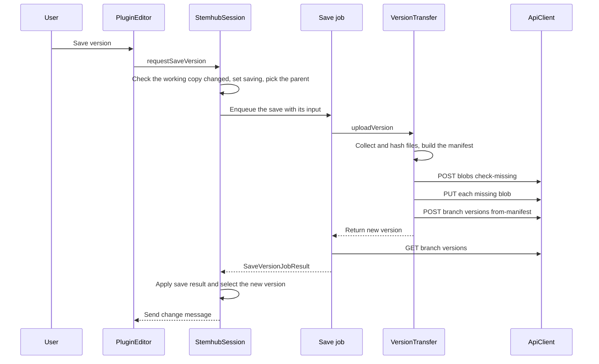
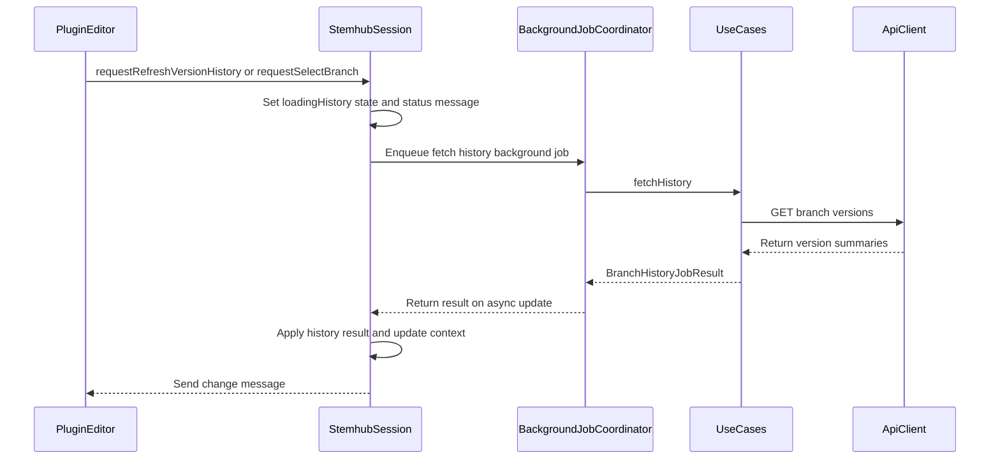
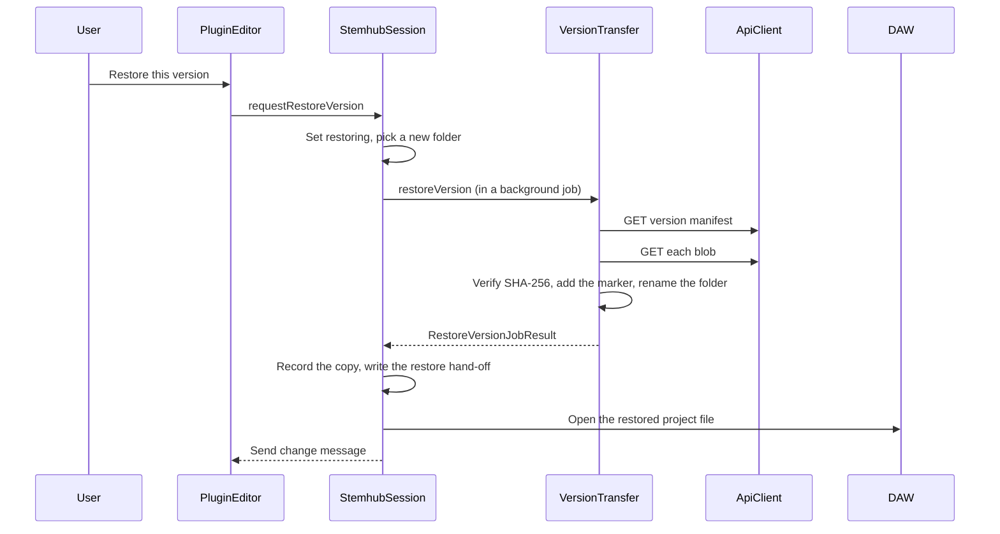

# StemHub Plugin Data Flow (Sign In → Save, Refresh, Restore)

This document describes the end-to-end runtime flow in the StemHub plugin, our JUCE VST3: from signing in to saving a version, refreshing a branch's history and restoring a version. Terms follow the glossary in [SPECIFICATION.md §19](./SPECIFICATION.md#19--glossary).

The three actions on the dashboard:

- **Save** creates a version on the open branch from the working copy (the local project file), uploading only the files the server doesn't have. It is not the DAW's own save (Ctrl/Cmd+S), which the StemHub plugin leaves to the DAW.
- **Refresh** reloads the branch's history. It moves no files.
- **Restore** downloads a version into a new folder and opens it in the DAW as a separate copy. The working copy is never overwritten.

## 1) Main Components And Responsibilities

- `StemhubAudioProcessor` (`plugin/stemhub/Source/src/application/PluginProcessor.cpp`)
  - What the host sees: audio passes through untouched. Owns the `StemhubSession`, saves its project link
    in the DAW project, and creates the editor.
- `StemhubAudioProcessorEditor` (`plugin/stemhub/Source/src/ui/PluginEditor.cpp`)
  - Owns the views, and turns clicks into `StemhubSession`'s intents (`requestSignIn`,
    `requestOpenProject`, `requestSaveVersion`, `requestRefreshVersionHistory`,
    `requestRestoreVersion`, etc.). Keys the StemHub plugin doesn't use, Cmd/Ctrl+S among them,
    go to the DAW.
- `SessionPresenter` (`plugin/stemhub/Source/src/ui/SessionPresenter.cpp`)
  - Works out what each screen shows from `SessionState`: plain view models, without widgets, so
    the tests check them. `UiFormat` writes times, sizes and titles the same way everywhere.
  - The views (`LoginView`, `ProjectSelectionView` with its tiles, `DashboardView` with the
    `VersionHistoryList` and the `VersionDetailCard`) each take their model and change only what
    differs from what they show.
- `StemhubSession` (`plugin/stemhub/Source/src/application/StemhubSession.cpp`)
  - Holds one StemHub plugin instance's state: the sign-in session and the project open here. The
    single owner of `SessionState`, used only on the message thread.
  - Starts one background job at a time, applies its result, and tells listeners through its
    `ChangeBroadcaster`.
- `BackgroundJobCoordinator` (`plugin/stemhub/Source/include/application/BackgroundJobCoordinator.hpp`)
  - Runs jobs on a `juce::ThreadPool` and hands their results to the message thread. Its
    owner's shutdown waits for the running jobs, so none outlives what it uses.
- `IProjectApi` / `ApiClient` (`plugin/stemhub/Source/src/network/ApiClient.cpp`)
  - One typed call per endpoint: auth, user, projects, branches, versions, version manifest,
    blob check/upload/download, version creation from a manifest. The HTTP plumbing is private;
    JSON parsing lives in `ApiJson.cpp`. Every failure is an `ApiError` with a kind (network,
    unauthorized, not found, server, ...). `SignedInApi` is the same API with the signed-in
    user's token on every call; each signed-in job gets one.
- `VersionTransfer` (`plugin/stemhub/Source/src/application/VersionTransfer.cpp`, `stemhub::versiontransfer`)
  - Stateless content-addressed transfer. `uploadVersion` hashes the project's files, uploads
    what the server lacks, then creates the version; `restoreVersion` downloads into a hidden
    folder, verifies every SHA-256, then renames the folder into place.
- `UseCases` (`plugin/stemhub/Source/src/application/UseCases.cpp`)
  - The background work of each action, as functions from an input built on the message
    thread to a result `StemhubSession` applies.
- `VersionFiles` (`plugin/stemhub/Source/src/application/VersionFiles.cpp`, `stemhub::versionfiles`)
  - The one rule for which files a save takes: the project file, then the assets (the audio and
    MIDI files in its folder and subfolders), without hidden files, `Backup` folders, and copies
    the StemHub plugin restored there (folders holding a `.stemhub-restored` marker). The save and
    the dashboard's "12 files · 340 MB" count both use it; the editor counts in the background.
  - Hashes files, reading them in large blocks and stopping when its job is asked to.
- `stemhub::manifest` (`plugin/stemhub/Source/src/domain/Manifest.cpp`)
  - The version manifest format in one place: written as v2 for a save, and validated (v1 or v2)
    before a restore (see `docs/content-addressed-storage.md`).
- `WorkingCopyIndex` (`plugin/stemhub/Source/src/application/WorkingCopyIndex.cpp`)
  - Which version each working copy holds: written after every save and restore, read when a
    project opens (see section 12).

## 2) Data Objects Moving Through The Flow

- `SessionState` holds all of it:
- Sign-in: `currentUser` and `accessToken` (both set while signed in), `uiState` (the project grid or the dashboard; signed out, the login screen shows), `operationState` (the one job running: `signingIn`, `loadingProjects`, `saving`, `loadingHistory` or `restoring`)
- `link`: the StemHub project, branch and working copy of the DAW project this instance lives in
- Messages: one `Status` (severity + text) per screen: `authStatus`, `projectsStatus`, `dashboardStatus`
- Project selection: `projects`, `selectedProject`, `branches`, `selectedBranchId`
- Versioning: `versionHistory`, `selectedVersionId`, `openedVersionId` (the version in the DAW), `lastSavedVersionId` (set only when a save creates a version: the editor clears the message field then, and keeps it after a failed or cancelled save)
- Files: `chosenProjectFile` (picked on the project grid, for the next project opened or created there), `workingFile` (the working copy: the project file the open project saves from and its link names; it may be missing, on a drive that isn't plugged in, and stays until the user picks another), `workingCopy` (the baseline: file, version id, size and modification time recorded by the last save or restore, read back from the working-copy record when a project opens)
- Background payloads: `AuthRequestResult`, `ProjectActivationJobResult`, `BranchHistoryJobResult`, `SaveVersionJobResult`, `RestoreVersionJobResult`. Each is a `JobOutcome` (an error message, a status for the user, and whether the backend refused the token) plus what the job produced.

## 3) End-To-End Lifecycle

1. The DAW loads the project: the processor hands the link saved in it to `StemhubSession`. If the
   DAW is opening a copy the StemHub plugin has just restored, the restore hand-off replaces the
   link (see section 12).
2. The StemHub plugin's editor is created: the saved token signs the user back in, or the user
   signs in from the Login view.
3. `StemhubSession` fetches user + projects. The linked project opens (its branch and working copy);
   without a link, the UI moves to Project Selection. An instance still without a link takes a
   hand-off meant for any project only now, since hosts may open the window before handing back
   the saved link.
4. User opens an existing project or creates one from a project file (`.flp` / `.als`). A file
   chosen on the grid goes with the next project opened or created there; otherwise a project
   keeps its own working copy and branch only if it is the one open here or the linked one, and
   opens without a working copy otherwise. A project created before a later step fails is still
   added to the grid.
5. `StemhubSession` fetches branches and the branch's history; UI moves to Dashboard. The
   working-copy record says which version the working copy holds, if this machine saved or
   restored it for this project and branch. When the project is opened from the grid and this
   instance has no working copy (or an unchanged copy of an older version), the latest version is
   restored into a new folder under `Documents/StemHub` and opened in the DAW as a project of its
   own. Unsaved changes are never replaced.
6. User saves a version:
   - files are hashed and only the ones the server lacks are uploaded,
   - the version is created from the manifest,
   - the history is fetched in the same job and the new version is selected.
7. User refreshes the history, or switches branch:
   - the StemHub plugin calls the branch's version-history endpoint,
   - updates the selected version and the dashboard.
8. User restores a version: it is downloaded into a new folder and opened in the DAW as a
   project of its own. The instance that restored it stays with its own working copy.

## 4) Runtime Pattern Used By All Requests

All major actions follow the same async pattern:

1. UI calls a `StemhubSession::request*` intent. While another job runs it is ignored (sign-out
   excepted), and the views disable the controls that would send it.
2. `start()` sets the operation state and a progress `Status` on the operation's screen, and
   starts a new request epoch.
3. It enqueues the use case with an input built on the message thread (ids, files). Signed-in
   jobs get a `SignedInApi`, the API with the token `StemhubSession` had when the job started.
4. A worker runs the use case and returns its typed result; the coordinator queues it with the
   epoch and calls `triggerAsyncUpdate()`.
5. `handleAsyncUpdate()` runs on the message thread and takes the queued results.
6. A result is applied only if its epoch is still the latest. Signing out starts a new epoch, so
   whatever was running before is dropped when it finishes.
7. `finish()` applies the one rule every job ends with: `StemhubSession` is idle again; a refused
   token signs the user out; a failure (or a cancel) shows on the operation's screen. Otherwise
   `StemhubSession` applies the rest of the result.
8. `StemhubSession` calls `sendChangeMessage()`. The editor's `refreshSessionUi()` gets the visible
   screen's model from `SessionPresenter`, and that view updates what changed.

While a job runs it can post progress reports ("Uploading 12 of 40 new files...") through the
same queue, tagged with its epoch; they replace the progress status until the result arrives.

**Stopping jobs.** Long work checks `isJobCancelled()` between steps: while it walks the project
folder, between two files it hashes, uploads or downloads, during an upload (JUCE's progress
callback) and between blocks of a download. It is true once the thread pool asks the job to stop,
which happens when:

- the user presses Cancel (`cancelRequest()`): the job ends with "Save cancelled.",
  "Restore cancelled." or "Sign-in cancelled.", unless it had already finished, and a cancelled
  restore removes its folder;
- the user signs out: the old sign-in session's jobs stop, and their results are dropped anyway;
- the StemHub plugin closes: `shutdown()` asks every job to stop and waits for them, which now takes
  about as long as the slowest request in flight rather than the whole transfer. Closing the
  StemHub plugin window does the same for the dashboard's file count.

## 5) Connect / Sign-In Flow

### API calls

- `POST /auth/login`
- `GET /auth/me`
- `GET /projects/`

With a saved token (`requestResumeSignIn`, when the StemHub plugin window opens) the login
call is skipped: the token is checked by fetching the user. Only a refused token signs the user out;
offline, the token is kept.

### Sequence

```mermaid
sequenceDiagram
    participant U as User
    participant E as PluginEditor
    participant P as StemhubSession
    participant J as BackgroundJobCoordinator
    participant A as ApiClient

    U->>E: Click Sign in
    E->>P: requestSignIn
    P->>P: Set signing-in state and clear the previous user's data
    P->>J: Enqueue sign in background job
    J->>A: Login request POST auth login
    J->>A: Fetch current user GET auth me
    J->>A: Fetch projects GET projects
    J-->>P: AuthRequestResult
    P->>P: Handle async update and apply auth result
    P->>P: Store token user projects and switch to project selection
    P-->>E: Send change message
    E->>E: refreshSessionUi
```

## 6) Project Activation Flow (Open Existing Or Create)

### Open existing project

- Input: selected `projectId` + optional working copy.
- API calls:
  - `GET /projects/{projectId}/branches/`
  - `GET /branches/{branchId}/versions/`
- Output:
  - `selectedProject`, `branches`, `selectedBranchId/name`, `versionHistory`, `selectedVersionId`
  - `UIState::dashboard`

### Create project

- Input: a project file (`.flp` / `.als`)
- API calls:
  - `POST /projects/`
  - `GET /projects/`
  - `GET /projects/{newProjectId}/branches/`
  - `GET /branches/{branchId}/versions/`
- Output: same dashboard activation state as open flow.

## 7) Save Flow

### Preconditions enforced by `StemhubSession`

- No other save, restore or project load is running.
- Selected project exists.
- Selected branch exists.
- The working copy exists on disk and changed since the last save or restore ("No changes to
  save" otherwise: the user saves the project in the DAW first).

### Data path

1. UI triggers `requestSaveVersion(message)`. The message is optional; a version saved without
   one shows as untitled in the history. The DAW name comes from the project file's extension.
2. `StemhubSession` picks the parent version (the working copy's version, else the branch head) and
   enqueues the job with everything it needs. The working copy's version survives a restart of
   the DAW through the working-copy record, so a collaborator's newer version is never taken
   for the parent of a file that doesn't contain it.
3. `stemhub::versiontransfer::uploadVersion(...)` hashes the files `versionfiles::collect` lists
   (paths relative to the project file's folder, checked against the backend limits first),
   builds the v2 manifest, then calls the backend:
   - `POST /projects/{projectId}/blobs/check-missing`
   - `PUT /projects/{projectId}/blobs/{sha256}` for each missing file
   - `POST /branches/{branchId}/versions/from-manifest` (with `message` and `parent_version_id`)
4. The job fetches `GET /branches/{branchId}/versions/`; `StemhubSession` selects the new version
   and makes it the parent of the next save.

The dashboard shows "Preparing 3 of 40 files...", then "Uploading 2 of 5 new files...", with a
Cancel link. A cancel before the version is created creates nothing; once it is, the save
stands.

### Sequence

```mermaid
sequenceDiagram
    participant U as User
    participant E as PluginEditor
    participant P as StemhubSession
    participant W as Save job
    participant V as VersionTransfer
    participant A as ApiClient

    U->>E: Save version
    E->>P: requestSaveVersion
    P->>P: Check the working copy changed, set saving, pick the parent
    P->>W: Enqueue the save with its input
    W->>V: uploadVersion
    V->>V: Collect and hash files, build the manifest
    V->>A: POST blobs check-missing
    V->>A: PUT each missing blob
    V->>A: POST branch versions from-manifest
    V-->>W: Return new version
    W->>A: GET branch versions
    W-->>P: SaveVersionJobResult
    P->>P: Apply save result and select the new version
    P-->>E: Send change message
```

## 8) Refresh Flow (Branch History)

This is triggered by:

- the user pressing Refresh on the dashboard,
- the user selecting another branch,
- a successful save (fetched inside the save job).

Refresh only reloads the list of versions: it downloads no files and changes nothing on disk.

### API call

- `GET /branches/{branchId}/versions/`

### Sequence

```mermaid
sequenceDiagram
    participant E as PluginEditor
    participant P as StemhubSession
    participant J as BackgroundJobCoordinator
    participant V as UseCases
    participant A as ApiClient

    E->>P: requestRefreshVersionHistory or requestSelectBranch
    P->>P: Set loadingHistory state and status message
    P->>J: Enqueue fetch history background job
    J->>V: fetchHistory
    V->>A: GET branch versions
    A-->>V: Return version summaries
    V-->>J: BranchHistoryJobResult
    J-->>P: Return result on async update
    P->>P: Apply history result and update context
    P-->>E: Send change message
```

## 9) Restore Flow

### Data path

1. The user presses "Restore this version" on the version's detail card. The editor restores
   next to the working copy's folder (or asks for a folder when that one isn't there), says the
   version opens as a project of its own, and on confirmation calls
   `requestRestoreVersion(versionId, folder)`. Opening a project from the grid without a working
   copy restores its latest version the same way, into `Documents/StemHub/<project>/<branch>/`.
2. `StemhubSession` names a new folder inside it that doesn't exist yet (`<name>-<id8>`, then
   `<name>-<id8> (2)`, ...): an earlier restore may hold the user's edits and is never reused.
3. `stemhub::versiontransfer::restoreVersion(...)` calls the backend:
   - `GET /versions/{versionId}` for the manifest (v1 or v2), validated by `stemhub::manifest`
   - `GET /projects/{projectId}/blobs/{sha256}` for each file, following a signed-URL redirect
     without the bearer token
4. Files land in a hidden folder next to the destination and each SHA-256 is verified; the
   folder gets a `.stemhub-restored` marker and is renamed into place only once all are there.
5. The restored project file is recorded in the working-copy record with its version, a restore
   hand-off is written (section 12), and the DAW is asked to open the copy. The instance that
   restored it keeps its own working copy.

Full detail: [content-addressed-storage.md](./content-addressed-storage.md), "Restore flow".

### Sequence

```mermaid
sequenceDiagram
    participant U as User
    participant E as PluginEditor
    participant P as StemhubSession
    participant V as VersionTransfer
    participant A as ApiClient
    participant D as DAW

    U->>E: Restore this version
    E->>P: requestRestoreVersion
    P->>P: Set restoring, pick a new folder
    P->>V: restoreVersion (in a background job)
    V->>A: GET version manifest
    V->>A: GET each blob
    V->>V: Verify SHA-256, add the marker, rename the folder
    V-->>P: RestoreVersionJobResult
    P->>P: Record the copy, write the restore hand-off
    P->>D: Open the restored project file
    P-->>E: Send change message
```

## 10) Error Propagation Model

- HTTP/network/parsing errors are converted to `ApiError` in `ApiClient`; a 401 anywhere ends the
  sign-in session and returns to the login screen. Offline at startup, the saved token is kept.
- Use cases put the error in their result's `errorMessage` (and flag a 401 as `sessionExpired`).
- `StemhubSession` turns it into a `Status` with a severity (info, progress, success, warning, error)
  on the screen where the action started: `authStatus`, `projectsStatus` or `dashboardStatus`.
- The editor maps each severity to the theme's status style; it never guesses from the text.

## 11) Independence Boundaries In The StemHub Plugin

- UI layer does not call backend directly; it only talks to `StemhubSession`.
- `StemhubSession` does not perform HTTP directly; its jobs call the use cases, which use `IProjectApi`.
- `StemhubSession` and everything under it, and the presenter above it, build without JUCE's GUI and
  audio modules: the tests link only `juce_events` and `juce_cryptography`.
- Network layer (`ApiClient`) is replaceable via `IProjectApi` injection (the tests use a fake).
- Versioning logic (`VersionTransfer`, `VersionFiles`, `stemhub::manifest`) is isolated from view logic and from JUCE widgets.
- Background execution is centralized (`BackgroundJobCoordinator`) and shared by all request types.

## 12) What Is Saved Where

- **In the DAW project** (the StemHub plugin's state, one per instance):
  `<StemhubState schema="1" projectId=".." branchId=".." workingFile=".."/>`. The processor keeps
  a copy the host can read from any thread and marks the DAW project as modified when the link
  changes. The version the working copy holds is never saved there: a restored copy carries the
  state saved with an older version. (These XML names predate the glossary and are kept on
  purpose: renaming them would break DAW projects already saved with the StemHub plugin.)

The StemHub plugin's own files are in its app data folder (`stemhub::folders::appData()`):
`~/Library/Application Support/Stemhub` on macOS, `%LOCALAPPDATA%\Stemhub` on Windows (not the
roaming profile: these files name paths on this machine), `~/.config/Stemhub` on Linux.

- **`credentials.json`**: the access token, shared by every instance. Its folder is 0700 and the
  file 0600 on macOS and Linux. Signing out or a refused token deletes it.
- **`pending-restore.json`**: the restore hand-off. The instance that restores a version writes
  it (project, branch, restored file) just before asking the DAW to open the copy. The instance
  the DAW loads with that project takes it, once; an instance without a link takes any. Nobody
  taking it within 10 minutes means the DAW didn't open the copy, and it is dropped.
- **`working-copies.json`**: the working-copy record. For each project file this machine saved
  or restored: its project, branch and version, with its size and modification time then. Every
  instance writes it after a save or a restore (under a lock shared by all processes) and reads
  it when a project opens, so after a restart a save still builds on the version its file holds,
  and an unchanged file is still not saved again. It keeps the 1000 files recorded last; a file
  that is missing stays recorded, since it may be on a drive that isn't plugged in.
- **`config.json`**: optional settings, such as the API base URL.

Versions restored when a project is opened without a working copy go to
**`Documents/StemHub/<project>/<branch>/<name>-<version>/`**, where the user can find and keep
them. A restored folder holds a `.stemhub-restored` marker.

Earlier versions of the StemHub plugin used `~/Library/Stemhub` on macOS and `%APPDATA%\Stemhub`
on Windows. On first start the StemHub plugin deletes the token and the hand-off left there (so
users sign in once), moves `config.json`, and leaves projects restored there where they are.
